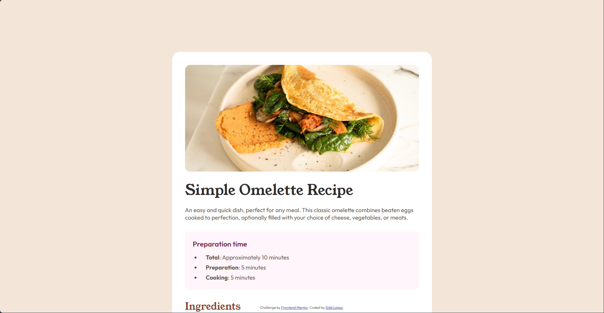

# Frontend Mentor - Recipe page solution

This is a solution to the [Recipe page challenge on Frontend Mentor](https://www.frontendmentor.io/challenges/recipe-page-KiTsR8QQKm). Frontend Mentor challenges help you improve your coding skills by building realistic projects. 

## Table of contents

- [Overview](#overview)
  - [The challenge](#the-challenge)
  - [Screenshot](#screenshot)
  - [Links](#links)
- [My process](#my-process)
  - [Built with](#built-with)
  - [What I learned](#what-i-learned)
  - [Continued development](#continued-development)
  - [Useful resources](#useful-resources)

## Overview

### Screenshot

### Links

- Live Site URL: [recipe page demo](https://siddlopez.github.io/recipe-page/)

## My process

### Built with

- Semantic HTML5 markup
- CSS custom properties
- Flexbox
- Mobile-first workflow
- clamp()
- @font-face
- root variables

### What I learned

Mainly, I learned the importance of clamp function on early development because it can get a little tedious later to change this values with media queries.
Also I'm starting to learn when to use padding and margin properly. There are some cases that one works better than the other and it important to create variables to store this values so later I won't have to change every property on each time it is called.

### Continued development

It is completely necessary that I get use to create variables for spacing and not just put random values on every property. Also with this comes along the use of clamp for better scaling design.

### Useful resources

- [Online clamp calculator](https://clampcalculator.com/how-css-clamp-calculator-works?vmin=375&vmax=1400&pmin=35.2&pmax=44&vu=vw&ou=rem&root=16) - This helped me to calculate better and faster the preferred value of the clamp function.